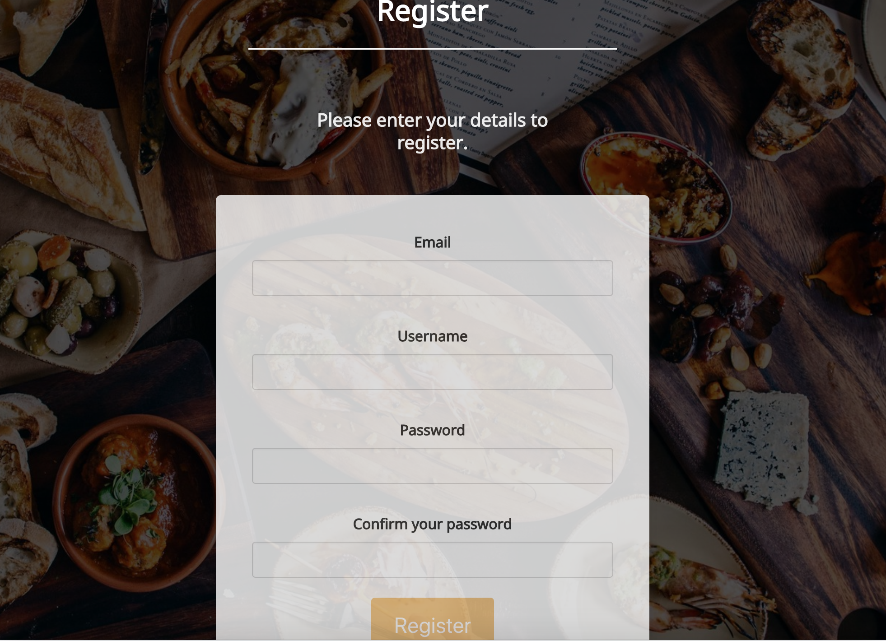
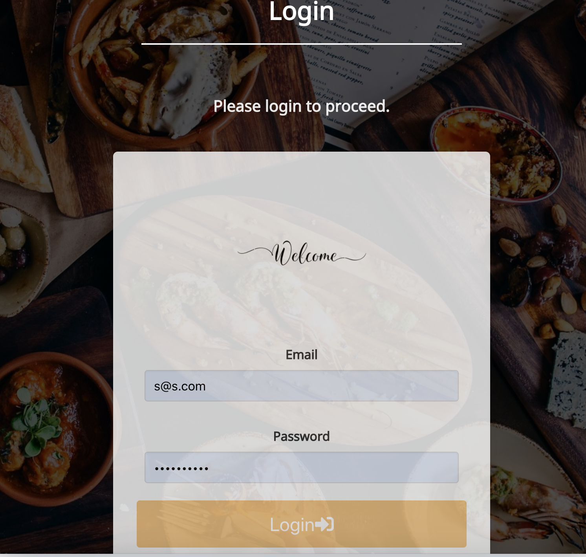
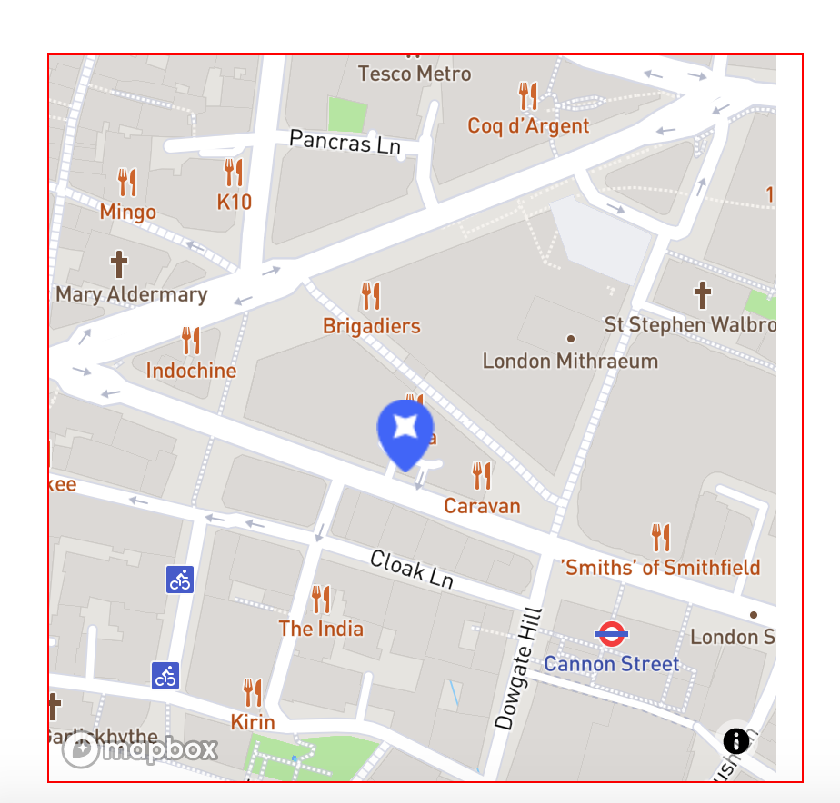
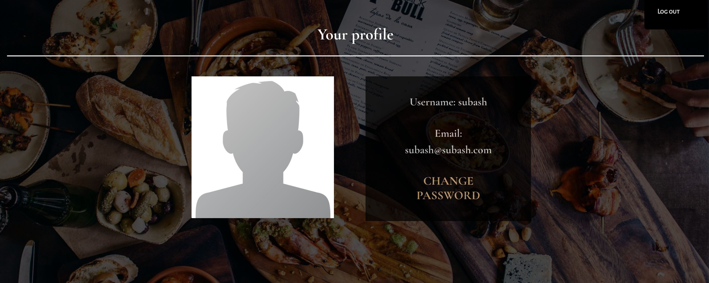
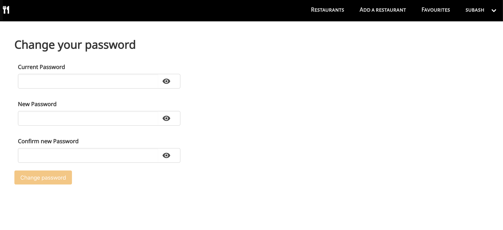

# GA Project 3 : A MERN Stack App - Group Project

###  General Assembly, Software Engineering Immersive
# Food For Thought

### Timeframe
7 days

## Technologies used

* HTML5
* SCSS
* JavaScript (ES6)
* React.js
* Express
* Mocha and Chai
* Node.js
* JSON
* Mongo and Mongoose
* Yarn, Babel, Webpack
* BCrypt, oAuth
* Bulma
* Google Fonts
* Moment
* Heroku, GitHub/Git


## APIs
* React Map GL (Mapbox)

## Contributors
* This was a group project with 4 members. The project was managed using Trello and daily zoom stand-ups.

## Installation

1. Set up a project repo by a git master
2. Clone the repo
3. Created the basic back-end and front-end files
4. Set up Webpack and installed all the dependencies packages
5. Set up and run the server
6. Open the `index.html` in browser
8. Deployed on Heroku

### App overview - 'Food For Thought'

Food For Thought app allows users to find the restaurants around London. They can search by cuisine type. 
Similarly, users can register and login and add new restaurants, comment, like, dislike, favourite them and upload images too. 

Restaurant location can also be seen via Mapbox.

You can launch the app on Heroku [here](https://foodforthought34.herokuapp.com/), or find the GitHub repo [here](https://github.com/subashlimbu/project-3).


### Users and sessions
The users can register on Food For Thought through Register Page and Sign In through Login Page. The users must be logged in to add new restaurants, see their favourited restaurant and add comments to the database.

Signed in users can access their Profile page from where they can change their password. They can also get an information of the restaurant in their email.


### Restaurants
You can view all Restaurants on the index page and search by cuisine or text input. Clicking on a Restaurant will take you to it's single page. Restaurants are uploaded by a logged in user.


Single Restaurant page includes the name, cuisine type, its's location on a map, comments, name of user who uploaded the comment.


### Back-end

**Schemata**

- For the MongoDB, we set up three schemata, comment schema made by user, one for restaurants that would be saved by the users and one for users.

- The restaurant schema simply included the relevant pieces of information and was linked up to the user schema. Only the name, address, postcode, telephone, cuisine and priceRange are required and none of the fields are forced to be unique as several users could save the same location to the database.

```js
  const commentSchema = mongoose.Schema({ //how come don't need 'new mongoose.Schema' 🤷‍♂️
  text: { type: String, required: true },
  user: { type: mongoose.Schema.ObjectId, ref: 'User', required: true },
  likedBy: [{ type: mongoose.Schema.ObjectId, ref: 'User', required: false }],
  dislikedBy: [{ type: mongoose.Schema.ObjectId, ref: 'User', required: false }] 
}, {
  timestamps: true
})
  const restaurantSchema = mongoose.Schema({
  name: { type: String, required: true },
  link: { type: String, required: false },
  address: { type: String, required: true },
  postcode: { type: String, required: true },
  telephone: { type: String, required: true },
  bookingLink: { type: String, required: false },
  cuisine: { type: Array, required: true },
  serveAlcohol: { type: Boolean, required: false },
  veggieFriendly: { type: Boolean, required: false },
  halalFriendly: { type: Boolean, required: false },
  priceRange: { type: Number, required: true },
  user: { type: mongoose.Schema.ObjectId, ref: 'User', required: true },
  comments: [commentSchema],
  image: { type: String, required: false },
  imageGallery: { type: Array, required: false }
})
```


```js
const schema = new mongoose.Schema({
  username: { type: String, required: [true, 'please enter a username'], unique: true },
  email: {
    type: String,
    required: [true, 'please enter an email address'],
    minLength: 8,
    unique: true,
    validate: [isEmail, 'please enter a valid email address']
  },
  password: {
    type: String,
    required: [true, 'please enter a password'],
    hide: true
  },
  favourites: [{ type: mongoose.Schema.ObjectId, ref: 'Restaurant', required: false }]
})
```
- The user schema also includes a virtual field for the password confirmation which is checked before validating the data point and allowing it to be saved. It also hashes the password prior to storing it.

**API End-points**

1. User

  |           	 | GET 	| POST 	| 
  |-----------	 |-----	|------	|
  | /register 	 |     	|   x  	|
  | /login    	 |     	|   x  	|
  | /restaurants |  x  	|   x  	|

- `/register` only has a post route, where the user's data is received and stored in the database.
- Similarly, `/login` only has a post route, where the user's login information is received, checked and, if valid, a token is return and saved to localStorage.
- `/restaurants` is the most complex route, having get and post options. 
  - The GET route returns a list of all the restaurants added to the database.
  - The POST route is used to add restaurants.

2. Comments

  |                      	    | GET 	| POST 	| DELETE |
  |----------------------	    |-----	|------	|--------|
  | /restaurants/:id/comments |  x  	|   x  	|    x   |
  

Comments has get, post and delete options. 
  - The GET route provides all information of the comments.
  - The POST route allows the user to create a comment but only by the user who created the restaurant.
  - The DELETE route allows the user who created the restarurant to delete it as well.

### Front-end

**Map**
- We used Uber's React Map GL package for Mapbox.
- We use the Postcode API to receive latitudes and longitudes for the postcodes saved in our database.

## Screenshots














## Process

The development process started with wireframes to guide the user's journey and core functionality of the site. We then decided the structure of the database and RESTful routes. Once our models were established for our database, we started working on setting up controllers for all routes. The api routes were then tested by making requests with Insomnia.  

With backend functioning, we paced on frontend to set up the RESTful routes with React.js. We referred back to our wireframes to create the layout of the pages and distributed work to implement functionality feature for each page. Functional and stateful components were made where necessary for each pages to ensure effective state management and a route was set up in the app.js file. Once the core frontend functionality was working we shifted our focus on styling the site.

Once we achieved our MVP, we ran tests on all CRUD routes including Login and Registration using Chai and Mocha with up mock data. Finally, we deployed our site on Heroku every other day to minimise any unforeseen deployment bugs.


Making use of git, we carried out individual work on branches for each feature. This was merged with the development branch and any merge conflicts were fixed as a group. Prior to pushing the code to the Master branch, all features were tested on the development branch.

Tasks were managed and assigned and we performed daily stand-ups over Zoom to keep track of the progress.


### Challenges

This was my first group project at General Assembly and with React.js. It was a steep learning curve particularly managing state and props. We also used git on our project which introduce new challenges such as conflicts while merging code to development branch and unexpected bug fixing on deployed version of the site.

### Wins

Most part of the project's basic structure was created as a group effort. My responsibility included frontend functionality, routes, error handling, form layout, testing and the site's styling.  

I created the search and dropdown box filter functionality, including the use of the React Mapbox and register, login and new restaurants form validations.


## Future features

Features that we wanted to add if time allowed are rating system for the restaurants. Also searching restaurants by postcode that would show the nearest and furthest restaurants. This would enhance users experience significantly on our site.